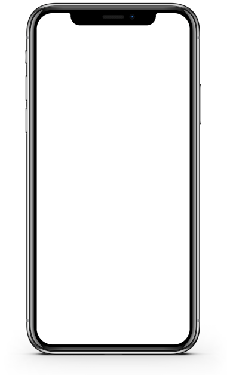

# 📱 Projeto Redes Sociais

<div align="center">
  
</div>

## 🚀 Introdução

Este foi um dos meus primeiros projetos de desenvolvimento web, criado com **HTML5** e **CSS3**. O projeto simula um smartphone com diferentes páginas de redes sociais carregadas através de iframes, oferecendo uma experiência interativa e visualmente atrativa.


### 🎯 Objetivo

Este projeto foi desenvolvido como parte do meu aprendizado inicial em desenvolvimento web, demonstrando conceitos fundamentais como:
- Estruturação semântica com HTML5
- Estilização avançada com CSS3
- Uso de iframes para carregamento dinâmico de conteúdo
- Design responsivo e interativo
- Animações e transições CSS

## 👨‍🏫 Inspiração e Agradecimentos

Este projeto foi **inspirado e solicitado pelo professor Gustavo Guanabara** do CursoemVídeo, como parte do desafio "Projeto Redes Sociais". Foi uma experiência incrível que me permitiu aplicar os conhecimentos adquiridos e desenvolver minha criatividade no desenvolvimento web.


## 🖥️ Visualizando o Projeto

<div align="center">
  
</div>

### 📱 Funcionalidades Demonstradas

- **Interface de Smartphone**: Simulação realista de um iPhone com frame personalizado
- **Navegação por Ícones**: Acesso rápido às diferentes redes sociais através de ícones clicáveis
- **Carregamento Dinâmico**: Conteúdo carregado via iframe para uma experiência fluida
- **Design Responsivo**: Adaptação perfeita para dispositivos móveis e desktop

## 🛠️ Como Instalar

### Pré-requisitos
- Navegador web moderno
- Servidor local (opcional, mas recomendado)

### Passos para execução:

1. **Clone o projeto:**
```bash
git clone https://github.com/guilh/Social-Project.git
```

2. **Navegue até a pasta do projeto:**
```bash
cd Social-Project
```

3. **Abra o arquivo principal:**
```bash
# Abra o arquivo index.html em seu navegador
# Ou use um servidor local como Live Server (VS Code)
```

## 🌐 Deploy

**Para acessar o projeto online:** [GitHub Pages](https://guilh.github.io/Social-Project)

## 📁 Estrutura do Projeto

```
Social-Project/
├── index.html          # Página principal
├── pages/              # Páginas das redes sociais
│   ├── home.html       # Página inicial
│   ├── instagram.html  # Simulação Instagram
│   ├── github.html     # Simulação GitHub
│   └── linkedin.html   # Simulação LinkedIn
├── style/
│   └── style.css       # Estilos principais
└── imagens/            # Recursos visuais
    ├── frame-iphone.png
    ├── favicon.ico
    └── logos das redes sociais
```

## 🎨 Tecnologias Utilizadas

<div align="center">
  
</div>

## 👨‍💻 Autor

**Guilherme Dantas** - [guilh](https://github.com/guilh)

## 🙏 Agradecimentos

Obrigado por ter chegado até aqui! Este projeto foi feito com muito carinho e dedicação, representando um marco importante na minha jornada de aprendizado em desenvolvimento web. 

Espero que tenha gostado do resultado! Se você se interessou pelo projeto, sinta-se à vontade para:
- 🌟 Dar uma estrela no repositório
- 🔄 Fazer um fork e contribuir
- 💬 Entrar em contato através do LinkedIn ou WhatsApp
- 👀 Explorar outros projetos do meu portfólio

---

<div align="center">
  
</div>
